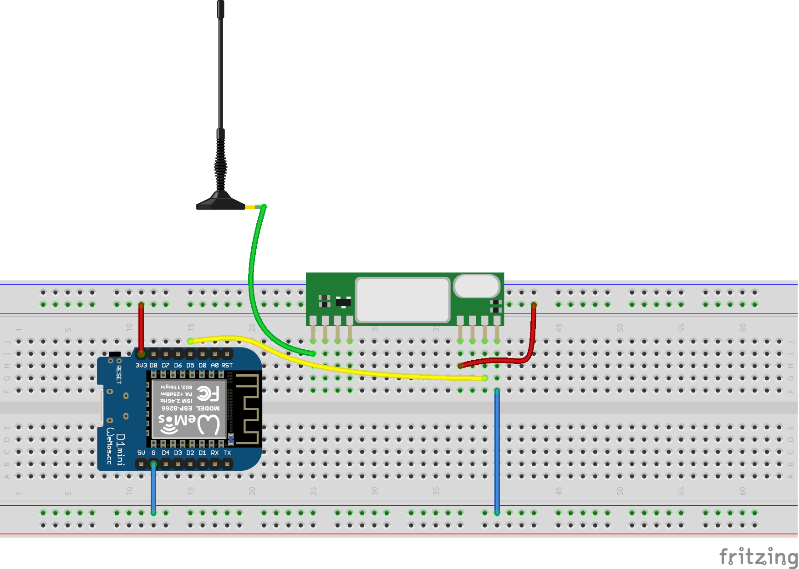
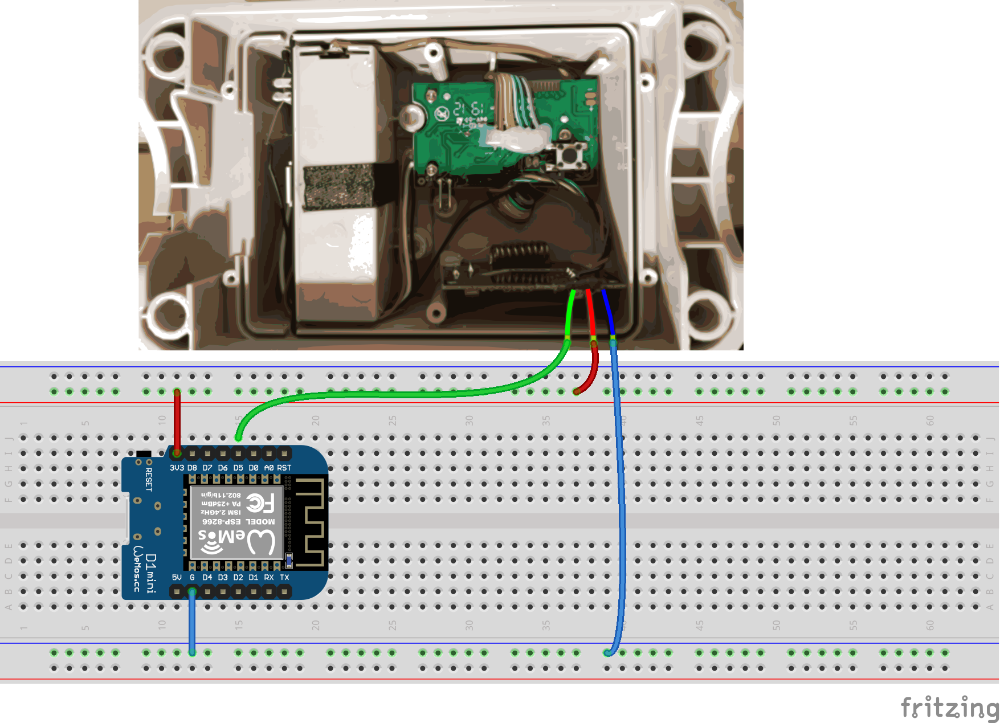

# WeatherStationDataRx
Arduino library for read weather data from Venus W174/W132 (tested), Auriol H13726, Hama EWS 1500, Meteoscan W155/W160

The transmission protocol of the weather station is described here: 
http://www.tfd.hu/tfdhu/files/wsprotocol/auriol_protocol_v20.pdf

<<<<<<< HEAD
The communication can be done via receiver module RXB6 or directly by modification at the transmitter (e.g. with Venus W132). 

### Communication via the receiver module

### Communication by modification at the transmitter Venus W132

=======
###The communication can be done via receiver module RXB6 or directly by modification at the transmitter (e.g. with Venus W132). 

Communication via the receiver module:

###Communication by modification at the transmitter Venus W132.
>>>>>>> 750c1c611261e50b4a140996bc2c247fc4f5b87e

## License

The MIT License (MIT)

Copyright (c) 2019 Zwer2k
